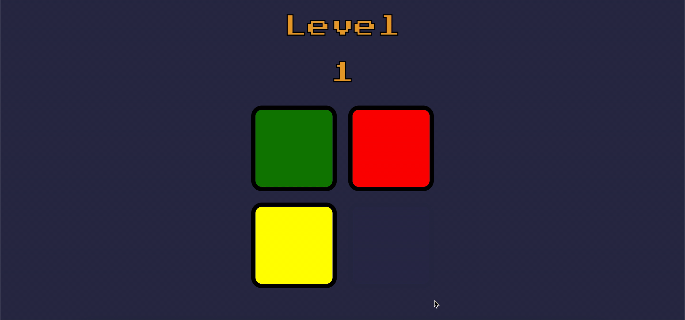

# simon-game

The device has four colored buttons, each producing a particular tone when it is pressed or activated by the device. A round in the game consists of the device lighting up one or more buttons in a random order, after which the player must reproduce that order by pressing the buttons. As the game progresses, the number of buttons to be pressed increases. (This is only one of the games on the device; there are actually other games on the original.)

If the sequence breaks, player looses.

